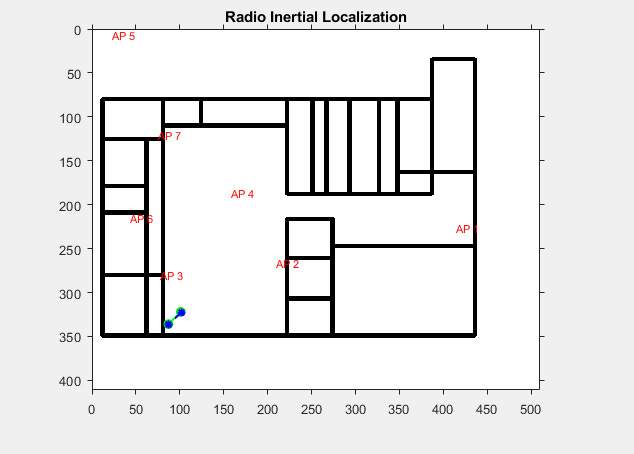

# Radio Inertial SLAM
This repository contains the simulation for Radio Inertial Localization using the [COST231 Radio Propagation Model](https://en.wikipedia.org/wiki/COST_Hata_model) and [Particle Filtering](http://ais.informatik.uni-freiburg.de/teaching/ws12/mapping/pdf/slam09-particle-filter-4.pdf). It contains 2 implementations: MATLAB (2D Localization only) and Python (2D and 3D Localization).

## Running the Simulation
To run the simulation, you can open MATLAB and run ```randomWalk.m```. You can choose parameters for operation as specified in the program. The parameters of main interest are:

* ```useClas```             : set to 1 if you want to use the classifier, else 0
* ```hardClassification```  : for a completely rejecting NLOS detections, set it to 1, else 0 _(uses a probabilistic model)_
* ```slam```                : set (1) to use FastSLAM , (0) to use particle filtering

The simulation takes 2 user inputs:

* __environment map__ -  you can choose one from the [assets](assets/) folder or make your own (dimensions should be same).
* __environment scale__ - given a map, you will be asked to select 2 points and give the distance in meters between them.

This is used to calibrate the number of pixels/meter in the real world space.

Routers can either be arbitrarily placed or placed as per user specifications (by changing the ```rand``` parameter). Once placed, the RSSI Signal Strengths for each of the routers throughout the map is calculated. After this a random walk based on the RRT algorithm generates a path for the motion of the user. Using this path, and the RSSI Signal Strengths, a distance map is calculated for each waypoint in the path. The distance map defines the euclidean and RSSI based distance calculated at each waypoint for each access point. This is then used in conjunction with a particle filter as a measurement model to estimate the difference between the true and estimated path hence serving the purpose of localization based on Radio Signals. A deep network is trained to classify between Line-of-Sight and Non Line-of-Sight data with an **accuracy of approximately 93%**. All NLOS signals are rejected, hence improving the accuracy of localization.

The animations for each of these are shown in the section below:

## Classifier - Stacked Autoencoder


A stacked autoencoder was chosen for us to be able to represent low dimensional data in a higher dimensional representation. The architecture of the network is as given above. It is used to classify between LOS/NLOS data points. You can either train the network yourself using ```dataClassify.m``` using one of the 3 mat files provided in the [data](data) folder or use the [pre-trained model](include/trainedModel.mat) in the include folder. You can also generate your own data for training by running ```dataCollection.m```.

The performance of localization with and without classification is measured by calculating the error in localization: _sum of euclidean distances between ground truth and estimated path_.

## Simulations
* The **green path** is the simulated **ground truth**
* The **blue path** is obtained using **localization**
* The **red AP** show the **ground truth of access point** locations
* The **black AP** show the **estimated position of access point** locations _(applicable only in FastSLAM)_

For the results shown below, *soft classification* has been used. Results vary with every run even for the same map and random walk. For the below simulations, **500 particles** were chosen. Increasing/decreasing the particles will improve/worsen the performance.

### Particle Filter
* **With Classifier:**


The performance as per the above designated measure for the particle filter using the classifier is **47.99**

* **Without Classifier:**



The performance measure for the particle filter without using the classifier is **416.4**

### Fast SLAM v1
* **With Classifier:**


The performance measure for FastSLAM v1 using the classifier is **193.97**. As can be seen, the agent is relatively confident about the location of the detected access points because the noise in the location (of the APs) has been set to a low amount (100 pixels). If the map is made noisier, the results may not be as shown in the figure above.

* **Without Classifier:**


The performance measure for FastSLAM v1 using the classifier is **623.87**. All the APs are detected in this case, however, only AP1 and AP4 can be seen in the near vicinity of the map.


## References
The COST231 Model code is adapted from [Salaheddin Hosseinzadeh](https://scholar.google.co.uk/citations?user=Rb5cEaoAAAAJ&hl=en)
